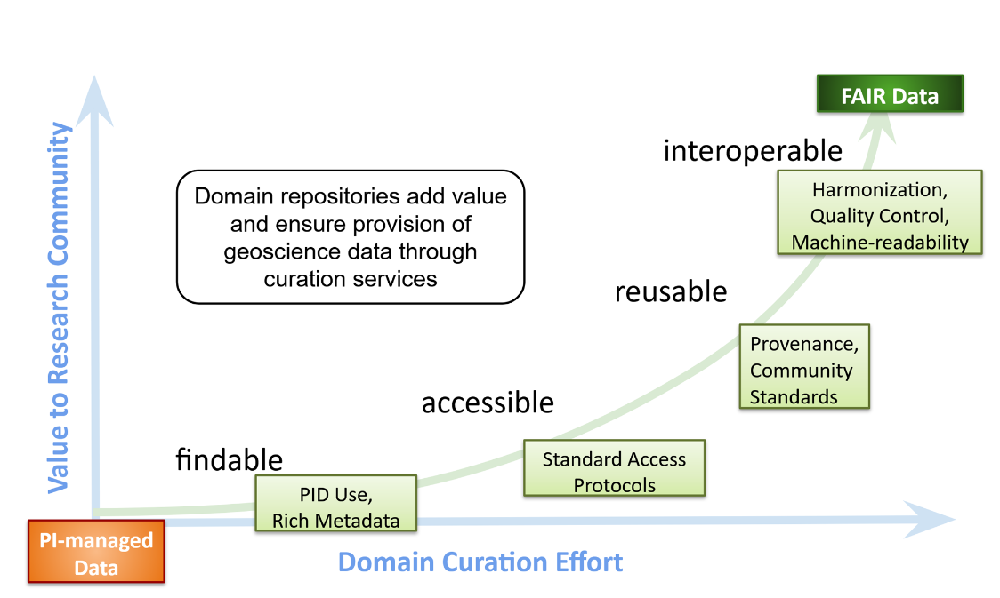



# Open Data

Open data = Documenting and sharing research data openly for re-use.  Data sharing benefits scientific advancement by promoting transparency,  encouraging collaboration, accelerating research and driving better decision-making.

Accordingly, there is an ongoing global data revolution that seeks to  advance collaboration and the creation and expansion of effective,  efficient research programs. When applying for grants nowadays, it is often required to share your data with the public:

* **NSF-OCE**: [Sample and Data Policy NSF Division of Ocean Sciences](https://www.nsf.gov/pubs/2017/nsf17037/nsf17037.jsp): *"PIs are expected to **share with other researchers and the public,** ..., the data,  samples, physical collections, and other supporting materials created or gathered in the course of work under NSF grants."*
* **Ocean Observatory Initiative**: [OOI Data Policy](https://ooi-website.whoi.edu/wp-content/uploads/2010/05/1102-00010_Data_Use_Policy_OOI.pdf): In principle, *all OOI data will be made **publicly available**, free of charge, to anyone.*
* **Biogeochemical Argo**: [data management rules](https://biogeochemical-argo.org/data-management.php): *data are made **publicly available***

When making your data freely available, it is important that end-users reusing data have all the knowledge necessary to be able to trust and understand the data they want to re-use.  End-users can be both humans and computers. Metrics to see if a package is truly "Open Data" are the  F.A.I.R principles. 

Repositories are here to make the journey to open data easier: juggling data  principles and policies, funding requirements, publication  specifications, research specifics, archiving and discovery through  online search engines. Repository types range from general repositories, which curate heterogeneous types of data, to Institutional repositories who are more familiar with the research at the institution to domain specific repositories (such as BCO-DMO). Domain-specific repositories have the role to make sure the data they receive have the correct domain- specific, standardized metadata and make them publicly available. 

So in short, the **data life cycle** follows this pattern: Data acquisition & analysis -> Data publication & preservation ->  Data Reuse (multiple researchers)

# Aligning data sources 

Once you have made your data online available for people to re-use it, there can often still be barriers that stand in the way of easily doing so. Reusing data from another source is difficult:  

* different way of requesting data
* different formats: you work with R while colleague is working with Matlab and the other one with python
* Need for standardised metadata

**This is where ERDDAP comes in.** It gives data providers the ability to, in a consistent way, download  subsets of gridded and tabular scientific datasets in common file formats and make graphs and maps. 

 

# Specific ERDDAP servers

There is no "1 ERDDAP server", instead organisations and repositories have their own erddap server to distribute data to end users. These users can request data and get data out in various file formats.  Many institutes, repo's and organizations (including [NOAA](https://coastwatch.pfeg.noaa.gov/erddap/index.html), [NASA](https://podaac-uat.jpl.nasa.gov/erddap/index.html), and [USGS](https://geoport.usgs.esipfed.org/erddap/index.html)) run ERDDAP servers  to serve their data. 

Each repository and/or program has its own type of data it is serving. To export data from a repository it is always useful to have a bit of a background of what data the serves contains and how the data structure is. For this workshop, we will use data from the following repositories and programs: 

[**BCO-DMO**](https://www.bco-dmo.org/)

* Serves data and information from biological, chemical and biogeochemical research conducted in coastal, marine, great lakes and laboratory environments. (Supporting  mainly NSF OCE bio & Chem sections) 

* BCO-DMO ERDDAP Server: [https://erddap.bco-dmo.org/erddap/index.html](https://erddap.bco-dmo.org/erddap/index.html) 

[**OOI**](https://oceanobservatories.org/)

* The OOI consists of five marine scientific arrays located in the North and South Atlantic and Pacific Oceans delivering real-time data from more than 800 instruments 
* OOI ERDDAP Server: [https://erddap.dataexplorer.oceanobservatories.org/erddap/index.html](https://erddap.dataexplorer.oceanobservatories.org/erddap/index.html) 

[**Argo**](https://argo.ucsd.edu/) 

* The [Global Argo Float](http://www.argo.ucsd.edu) program has almost 4000 real-time floats around the world that drift with the ocean currents and move up and down between the surface and a mid-water level. 
* Unfortunately, because of the complexity and international nature of the program, there isn't one "perfect" source to retrieve Argo data, or  even to search for drifters you may be interested in. 
* ERDDAP Server: http://www.ifremer.fr/erddap/index.html 

# Poll

Have you ever made data from a research project available online (either through a repository or the organisation)?

Have you ever reused data from a data provider?

