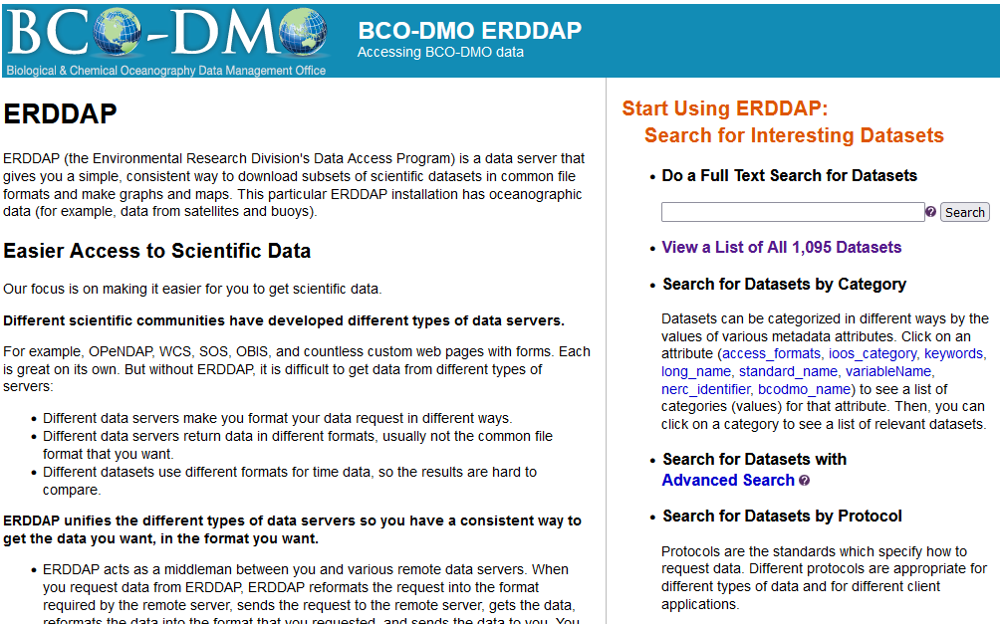
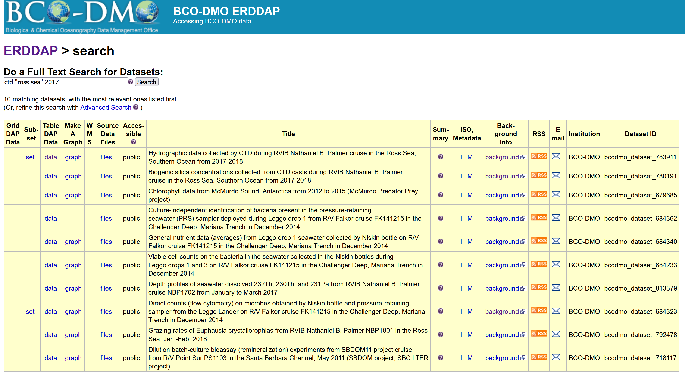
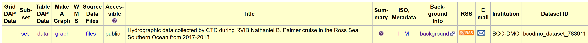
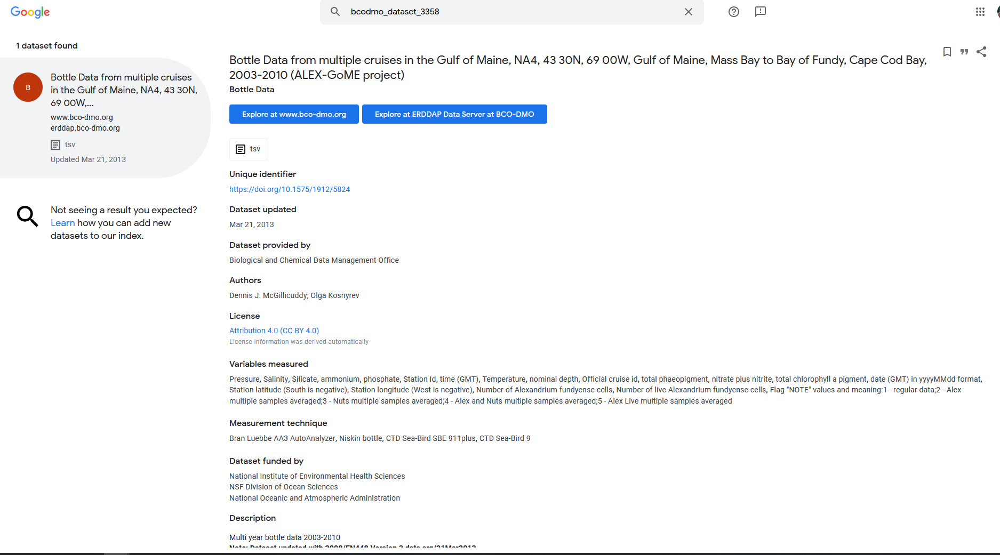
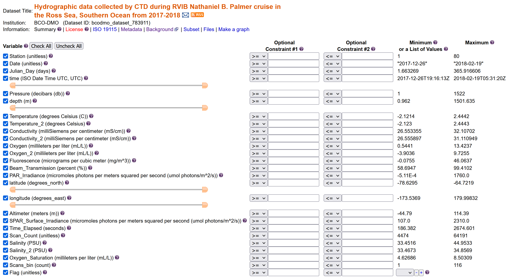
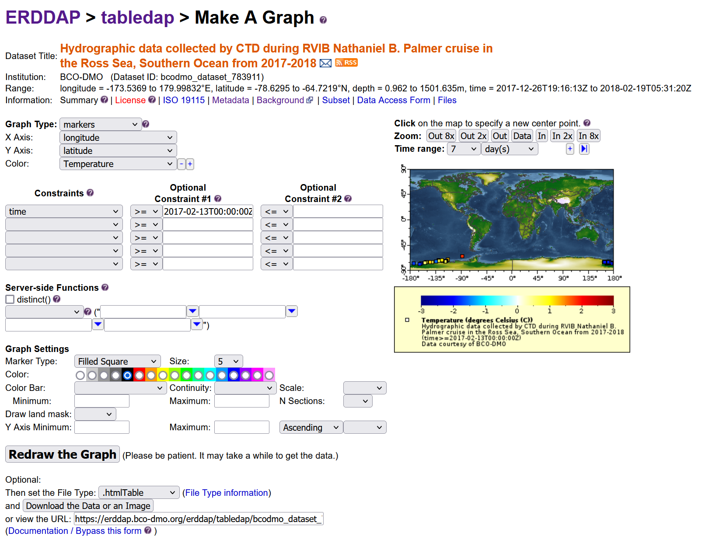



# Exploring an ERDDAP data catalog

In the chapter before we have seen that there are many ERDDAP servers to chose from. In this chapter we will dive a bit deeper in how to search for data in an ERDDAP catalog. 

## Finding data

For this example, we will use the ERDDAP operated by BCO-DMO:  go to:

[https://erddap.bco-dmo.org/erddap/index.html](https://erddap.bco-dmo.org/erddap/index.html)

To view all the available datasets on this erddap server click "View a List of all 1095 datasets"

Let's now search the database for specific data. Let's search for CTD data in the Ross Sea from 2017. Type in search box: ctd "Ross Sea" 2017. This is a full text search, just like Google, use white spaces in between words and double quotes "" around phrases

There are a couple of datasets that are popping up in this search, but let's choose the one with DatasetID: bcodmo_dataset_783911. 

## Dataset information

Within the search results you have access to information about each dataset to help you decide with which dataset is useful for your application.  

The listing (pictured above) gives access to a lot of information about the dataset. In a browser, try the following:
* Mouse over the question mark `?` under **Summary** to get an overview of the dataset.
* Click **"Background info"** to get more complete information from the data provider about the dataset. Now go back to the search results page.
* Click the `"M"` under **"ISO,Metadata"** to see all of the dataset metadata. A lot of information is displayed. Some important fields are:
  * Global attributes (general metadata) vs variable attributes (variable names & units)
  * `"geospatial_lat_min"`, `"geospatial_lat_max"`, `"geospatial_lon_min"`, and `"geospatial_lon_max"` for the spatial coverage
  * `"references"` for citing the dataset in publications
  * `"license"` for restrictions on using the data
  * `"acknowledgement"` often used to describe how to acknowledge use of the dataset
  * time: ERDDAP standardizes the dates+times in the results.  Data from other data servers is hard to compare    because the dates+times often are expressed in different formats    (for example, "Jan 2, 2018", 02-JAN-2018, 1/2/18, 2/1/18,    2018-01-02, "days since Jan 1, 1900").  For string times, ERDDAP always uses the ISO 8601:2004(E) standard format,    for example, 2018-01-02T00:00:00Z.  For numeric times, ERDDAP always uses "seconds since 1970-01-01T00:00:00Z".  ERDDAP always uses the Zulu (UTC, GMT) time zone to remove the difficulties    of working with different time zones and standard time versus daylight saving time.

These standardised variables are important for the dataset to be able to be "read" by other end-users and machines.

For example Google dataset search:

* open google dataset search: https://datasetsearch.research.google.com/

* search for the dataset id of the dataset above: bcodmo_dataset_783911

  

## Subsetting data

Click on the data button. Here is the link to the dataset in erddap: https://erddap.bco-dmo.org/erddap/tabledap/bcodmo_dataset_783911.html  

### Set the file type 

### Download the data "Submit"

## Create a graph

ERRDAP also provides a graph function for your datasets, but I will not go into this more in detail. 

## Exercise: Inspect BGC-Argo data

> * Go to the ERDDAP server: https://polarwatch.noaa.gov/erddap/.  
> * search “Biogeochemical-Argo” .  
> * Q:  how many datasets are being returned?
> * Q: What is the difference between the datasets? (Does the title give something away?)
> * Q:  What is the time range the datasets have? (Hint click data tab)
> * Download a dataset in .csv format that ranges in time from May 1st, 2015 until May 3rd 2015
{: .challenge}

