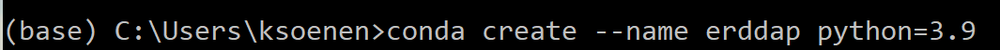
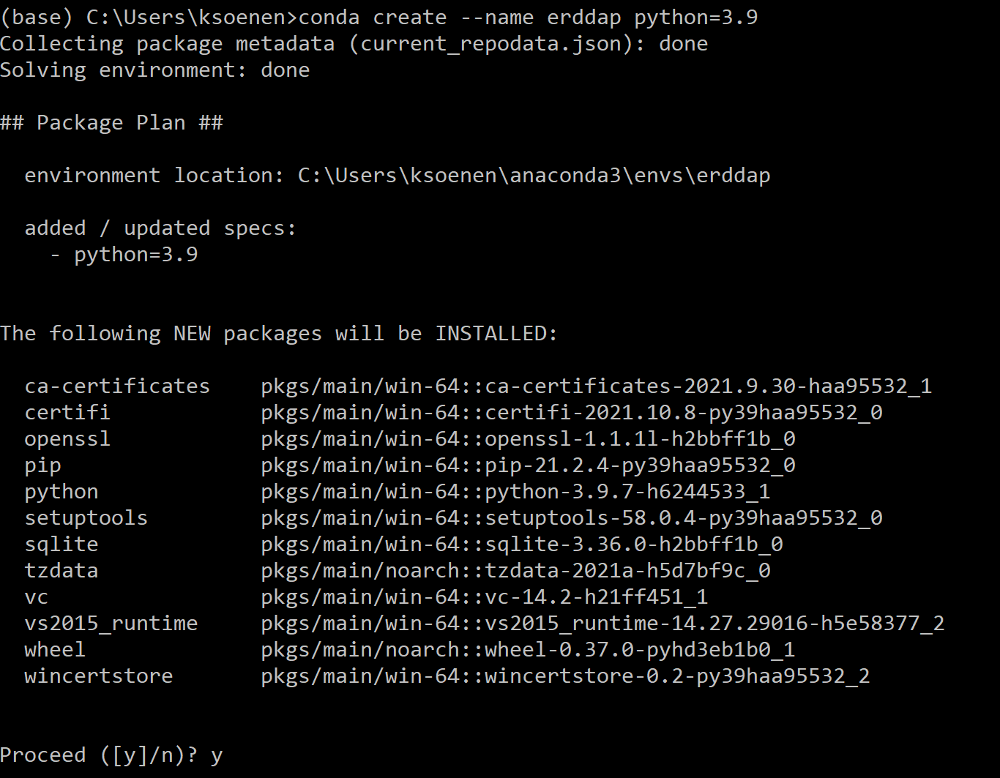
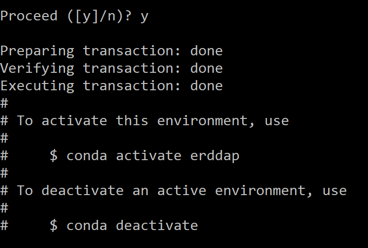
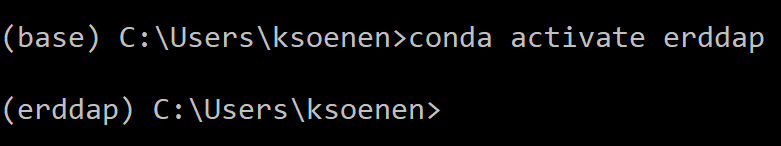
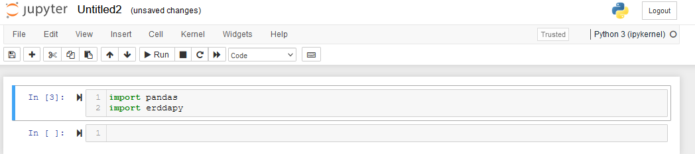
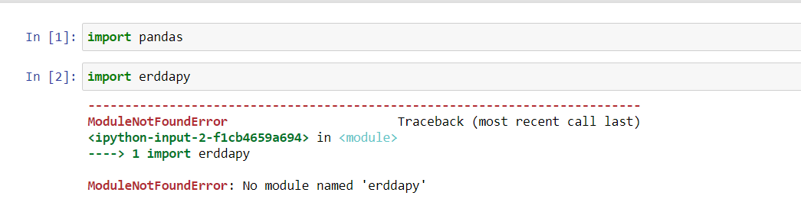
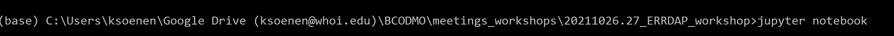
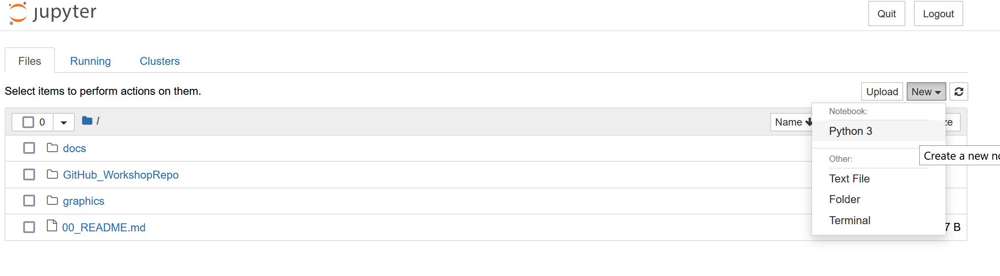




# Python - Anaconda

Anaconda is a Python distribution platform. It comes with the most popular data science libraries and their dependencies pre-installed, and a package manager to assist with installing additional libraries that weren’t pre-installed.

## 1. Installing Anaconda

#### Windows

1. Open https://www.anaconda.com/products/individual#download-section with your web browser.
2. Download the Anaconda for Windows installer with Python 3. (If you are not sure which version to choose, you probably want the  64-bit Graphical Installer *Anaconda3-...-Windows-x86_64.exe*)
3. Install Python 3 by running the Anaconda Installer, using all of the defaults for installation *except* make sure to check **Add Anaconda to my PATH environment variable**.

#### MacOS3

1. Open https://www.anaconda.com/products/individual#download-section with your web browser.

2. Download the Anaconda Installer with Python 3 for macOS (you can either use the Graphical or the Command Line Installer).

3. Install Python 3 by running the Anaconda Installer using all of the defaults for installation.

   

## 2. Create a new conda environment called "erddap"

**Make a new environment and launch jupyter notebooks using the new environment.**

You have to use a command line (Anaconda Prompt(Windows)  Terminal(Mac/Linux) to launch jupyter notebook, not the graphical  Anaconda Navigator.

**Steps**

1. Open Anaconda Prompt (Windows) or Terminal(Mac/Linux)

2. Enter the following command to create a new environment called "erddap" and define the python version to install with it. 

   ```conda create --name erddap python=3.9```

  

   Anaconda prompt view:    

    

   

   You will be asked if you would like to install the packages after they are found.  Press Yes (y).

   

   

3. Activate the environment that you just created

   ```conda activate erddap```
   
   after this command you should see (erddap) at the start of your line.

   


## 3. Install packages in the new "erddap" environment

1. Make sure that the **erddap environment is active**. You know that the erddap environment is active if you see (erddap) at the start of your line. If it is not active, activate the erddap environment with the following command:

   ```conda activate errdap```
   
2. Install the package "pandas" 

   ```conda install -c anaconda pandas```


   You will be asked if you would like to install the packages after they are found.  Press Yes (y).

3. Install the package "erddapy"

   ```conda install -c conda-forge erddapy```

   You will be asked if you would like to install the packages after they are found.  Press Yes (y).

   You should see messages for Preparing, Verifying, and Executing the "transaction" and end with a line    that says "done"


4. Launch the jupyter notebook with the following command. A new browser window should pop up with jupyter notebook in it.

   ```jupyter notebook```


   NOTE: I got the error "*jupyter' is not recognized as an internal or external command, operable program or batch file."* I installed jupyter in the environment with the following command: ```conda install -c anaconda jupyter```

6. Test if your your installs worked. See "Testing Your Installs" section Below.


## 4. Testing the installs

#### Jupyter Notebook

*if you have just followed the instructions to install packages and  test them, you already have launched jupyter notebook and can use that.  You can follow these instructions if you don't already have a notebook  running.

**Steps**

1. Open an Anaconda Prompt(Windows) or Terminal(Mac/Linux). 

2. Activate the erddap environment.  After this command you should  see the environment name "(erddap)"  or "base" at the start of  your line.

   ```conda activate erddap```
   
3. Launch the jupyter notebook with the following command. A new browser window should pop up right into your notebook.

   ```jupyter notebook```


   A browser window will open with your notebook in it. If you close  the page and need to get back to it, you can copy and paste the link  shown in your Anaconda Prompt/Terminal.  Or you can try the default  address	http://localhost:8888.

4. Once your notebook is open, import the pandas and erddapy library into the notebook with the following commands and run the cell. If no errors occur you successfully installed the packages!

   ``` import pandas```

   ``` import erddapy```
   
   


NOTE: Multiple users have installed their environment with the steps above, but still got the following error when testing their installs:



This issue got resolved when explicitly installing jupyter in the "erddap" environment. In order to do so, close your notebook, go to the anaconda prompt and check that your erddap environment is active (i.e (erddap) will be at the start of your line) and install Jupyter with the following command:

 ```conda install -c anaconda jupyter```

Check your installs again with the steps above. You should not get an error anymore.


###  Jupyter notebook basics

##### Open Jupyter notebook 

Make sure that you open Jupyter notebook at the same location you want your data to reside.

STEP 1. Start Jupyter Notebook

Anaconda prompt -> Direct to location -> Start Jupyter Notebook 



STEP 2: Open new notebook in the location



Reminder [Python Notebook Basics](https://nbviewer.org/github/jupyter/notebook/blob/master/docs/source/examples/Notebook/Notebook%20Basics.ipynb)

###### Edit mode

Edit mode is indicated by a green cell border and a prompt showing in the editor area:


When a cell is in edit mode, you can type into the cell, like a normal text editor.

Enter edit mode by pressing `Enter` or using the mouse to click on a cell's editor area.

###### Command mode

Command mode is indicated by a grey cell border with a blue left margin:


The most important keyboard shortcuts are `Enter`, which enters edit mode, and `Esc`, which enters command mode.

In edit mode, most of the keyboard is dedicated to typing into the  cell's editor. Thus, in edit mode there are relatively few shortcuts.   In command mode, the entire keyboard is available for shortcuts, so  there are many more.  The `Help`->`Keyboard Shortcuts` dialog lists the available shortcuts.

We recommend learning the command mode shortcuts in the following rough order:

1. Basic navigation: `enter`, `shift-enter`, `up/k`, `down/j`
2. Saving the notebook: `s`
3. Change Cell types: `y`, `m`, `1-6`, `t`
4. Cell creation: `a`, `b`
5. Cell editing: `x`, `c`, `v`, `d`, `z`
6. Kernel operations: `i`, `0` (press twice)
